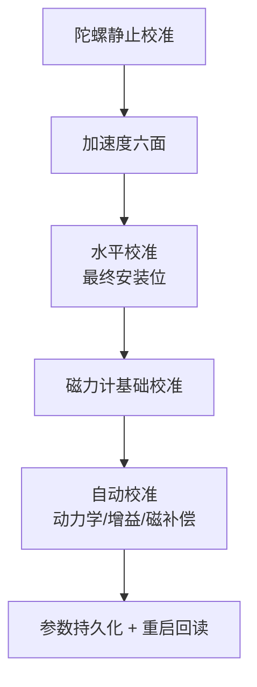
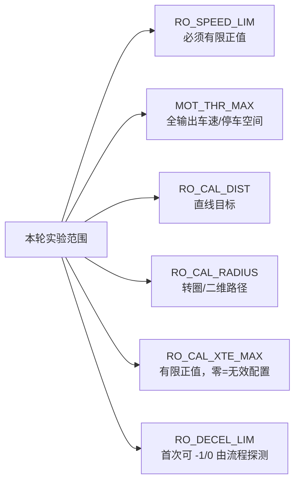

# 参数基线与三类必设

参数名称/类型/默认/范围/枚举/重启要求以**正式生成的参数目录**为准（QGC Metadata 同版提供）；本页给首次运行的设置建议与语义边界。来源：[部署指南 §2/§5/§6/§7](https://github.com/a1600778959/H743_FreeRTOS/blob/main/docs/H743_VEHICLE_COMMISSIONING_ZH.md#L41) 与[参数定义目录](https://github.com/a1600778959/H743_FreeRTOS/blob/main/Dima/middleware/parameters/README.md)。

## ① 人工必配/必核对（接线与几何——不能照抄）

| 参数 | 设置建议 | 语义边界 |
|------|----------|----------|
| `PWM_Sx_FUNC` | 按真实接线设 Motor right(101)/left(102)，至少各一路；未用通道 Disabled | 例：仅当 S1=左、S3=右 才设 `PWM_S1_FUNC=102`、`PWM_S3_FUNC=101` |
| `PWM_Sx_MIN/CENT/MAX` | 依电调资料+实测，严格 MIN<CENT<MAX；默认 1000/1500/2000 | 500–2500us 合法 ≠ 电调接受全范围；**CENT 必须真实停止中位** |
| `RC_MAP_THROTTLE/YAW` | 指向实际前后/转向杆（默认 1、2，仅接线匹配时保留） | RC 域先修正符号，不动 PWM 侧别 |
| `RC_MAP_ARM_SW` + `RC_ARMSWITCH_TH` | 二段解锁开关；先 OFF 再明确 ON 才是解锁请求 | 首次稳定状态只建基线 |
| `RC_MAP_KILL_SW` + `RC_KILLSWITCH_TH` | 易触及不误拨的独立开关 | 填参数≠急停有效，必须过 6.4 架空检查 |
| `RC_MAP_FLTMODE` + `COM_FLTMODE1..6` | 三段开关逐位置验证；首轮保留清晰 Manual 槽 | Auto Calibration 槽位值 23；同帧安全动作可抑制模式请求 |
| `SERIALx_FUNCTION/BAUD` | SBUS/GPS/MAVLink 唯一 owner；按真实接线核对（默认 SBUS=SERIAL6 不可照抄） | **不存在 SERIAL5**；SBUS 固定 100000 8E2 RX 反相；GPS 460800 |
| `RD_WHEEL_TRACK` | 实测左右轮中心间距（米）：560mm→0.560 | 不是轮胎外缘宽/轮周长；校准要求 >0 且 ≤5 m |
| `SENS_BOARD_ROT` / `CAL_MAG0_ROT` | 按实际安装姿态 | 不能用微调掩盖 90°/180° 装反 |
| `EKF2_GPS_POS_X/Y/Z`、`EKF2_IMU_POS_X/Y/Z` | 一致车体参考点实测（米，FRD） | 天线间距不是杆臂 |

<!-- Sources: docs/H743_VEHICLE_COMMISSIONING_ZH.md:115, docs/H743_VEHICLE_COMMISSIONING_ZH.md:155, docs/H743_VEHICLE_COMMISSIONING_ZH.md:200, Dima/middleware/parameters/definitions/module_rover_actuator_params.yaml -->

## ② 由校准产生（不可手编）

<!-- Sources: docs/H743_VEHICLE_COMMISSIONING_ZH.md:210, docs/H743_VEHICLE_COMMISSIONING_ZH.md:254 -->

| 域 | 产生方式 | 禁止 |
|----|----------|------|
| `CAL_GYRO0_*` / `CAL_ACC0_*` / `CAL_MAG0_*` | QGC 校准流程 / 自动校准优化 | 手工编造结果绕过检查 |
| `RO_SPEED_P/I`、`RO_YAW_RATE_P/I`、`RO_YAW_P` | 自动校准增益组（有证据的人工整定可补足） | 设任意正数只为 parameters_valid |
| `GPS_YAW_BASELINE/OFFSET` | 本轮 RTK 标定或核对已验证值 | 照搬另一台车 |
| 设备 ID / 安装旋转 / scale | 校准/装机事实 | 随意改写 |

## ③ 有默认值但必须验证（语义要点）

| 参数 | 默认/建议 | 语义边界 |
|------|-----------|----------|
| `MOT_THR_MAX` | 未知车辆**没有通用安全值**，架空验证后按轮设 | 归一化输出（0.2=20%），不是 m/s；自动校准制动观测会到全输出 |
| `MOT_THR_MIN` | 本车可稳定起步的最小正向输出 | ≤ MOT_THR_MAX；只影响非零轮端命令，精确零仍是零；不是遥控死区，不能修摇杆回中偏差 |
| `MOT_REV_DELAY` | 0.2s 换向中立等待 | 原地左右互换的短暂停顿可能是它 |
| `MOT_SLEW_RATE` / `MOT_ARM_RAMP` | 按电调要求保留/配置 | 0=禁用；启用后 Manual 回中也遵守斜率 |
| `SDLOG_MODE` | 首轮建议 2（启动到关闭） | 默认 0 只记录 Armed——无解锁无新日志≠SD 故障 |
| `SDLOG_PROFILE` | General Rover + Rover system identification（=5；需 EKF2 replay 用 7） | 修改后重启；高数据量先确认 SD 写入能力 |
| `EKF2_GPS_CTRL` | 默认 7（无双天线航向位）；自动 RTK 事务会保留现位打开 bit3 | 偏置方向未知时不要强行改 15 让状态变绿 |
| `UAVCAN1_*` | 默认自动分配/500k/本机 1 | 逐项核对本车总线 |

<!-- Sources: docs/H743_VEHICLE_COMMISSIONING_ZH.md:163, docs/H743_VEHICLE_COMMISSIONING_ZH.md:145, docs/H743_VEHICLE_COMMISSIONING_ZH.md:231, docs/H743_VEHICLE_COMMISSIONING_ZH.md:235 -->

## 自动校准实验范围四参数

<!-- Sources: docs/H743_VEHICLE_COMMISSIONING_ZH.md:256, docs/H743_VEHICLE_COMMISSIONING_ZH.md:262 -->

`RO_DECEL_LIM` 形成模型后按 `d = v²/(2a)` 估算停车距离——**速度翻倍距离四倍**；不要填未经测量的较大减速度换取更短估算距离。变更电调/供电/传动/轮径/载荷或显著修改输出整形后，原动力学结果不再自动适用。

## Related Pages

| Page | Relationship |
|------|-------------|
| [首次运行总流程](./first-run-flow.md) | 这些参数在各阶段的位置 |
| [分阶段验收标准](./stage-standard.md) | 设置之后怎么验 |
| [参数系统](../06-middleware/parameter-system.md) | 生成链与持久化机制 |
