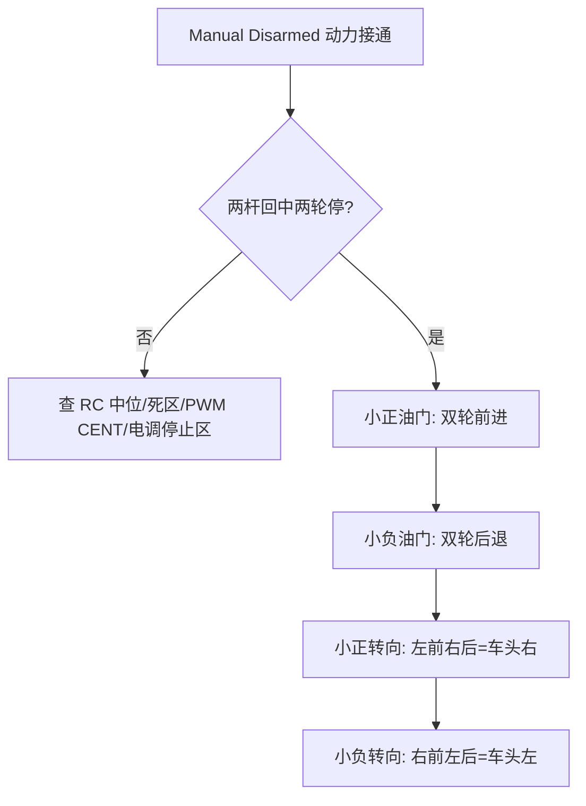
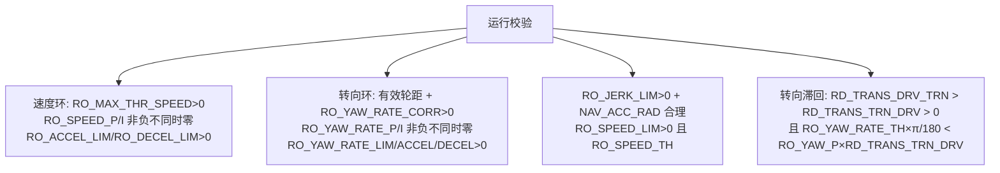

# 分阶段验收标准

每阶段"过不过"的判据。全部出处：[部署指南 §5–§11](https://github.com/a1600778959/H743_FreeRTOS/blob/main/docs/H743_VEHICLE_COMMISSIONING_ZH.md#L113)。

## RC 校准与方向（阶段 3）

**通过标准**：原始 RC 数据持续更新；中心稳定、端点可达；向前杆=正纵向、向右杆=正转向；两杆回中输入稳定为零（默认 RC1/RC2 死区 30us）；接收机自身 failsafe 时不得继续发布"健康的旧杆位"。

| 检查 | 不满足时 | Source |
|------|----------|--------|
| Radio 校准覆盖两端/中位/开关 | 重做校准 | [指南 §5.2](https://github.com/a1600778959/H743_FreeRTOS/blob/main/docs/H743_VEHICLE_COMMISSIONING_ZH.md#L125) |
| `RCn_MIN/TRIM/MAX/REV/DZ` 回读 | 在 RC 域修正，不动 PWM 侧别 | 同上 |
| `RC_MAP_PITCH/ROLL` | 仅 QGC 兼容标记，不为点亮页面虚构运动轴 | 同上 |

## 架空方向检查（阶段 4）

<!-- Sources: docs/H743_VEHICLE_COMMISSIONING_ZH.md:171 -->

方向约定：`right = T − S`、`left = T + S`，正转向=车头俯视顺时针；**倒车保持同一转向符号**（不按汽车方向盘习惯推断）。三层各管各的：`RCn_REV` 修输入方向、`PWM_Sx_FUNC` 定真实侧别、`PWM_Sx_REV` 匹配电机正反——**不能靠同时互换左右与反转遥控掩盖错误**。

## 故障动作（阶段 4）

| 检查 | 通过条件 |
|------|----------|
| 普通上锁 | 小输出请求 Disarm → 有效通道回 CENT、两轮停止 |
| Kill | PWM 停波、电调撤力；恢复后重新人工授权，**不以恢复开关为可开车证明** |
| RC 失联 | 关发射机 → 接收机 failsafe/超时 → 固件 Disarm |
| RC 恢复 | 不会自动解锁；Arm 开关回 OFF 后重新产生 ON 边沿 |
| 数据链断开 | 车辆继续运行是当前设计；操作员须知它≠RC 失联、无自动返航 |
| 重新上电 | 无非预期转动；参数和侧别正确恢复 |

<!-- Sources: docs/H743_VEHICLE_COMMISSIONING_ZH.md:187 -->

## 传感器与 RTK（阶段 5）

校准顺序：安装方向 → 陀螺静止 → 加速度六面（重车在总装前规划可翻转组件）→ 最终位置水平校准 → 磁力计基础校准（手动六面采样）→ 每项明确成功后再下一项。

**RTK 运动质量准入**（源码准入条件，非长期精度承诺）：

| 门 | 要求 | Source |
|----|------|--------|
| 位置 | RTK Fixed、EPH ≤ 0.15 m、样本新鲜、入场圆心 EPH > 0 | [指南 §7.3](https://github.com/a1600778959/H743_FreeRTOS/blob/main/docs/H743_VEHICLE_COMMISSIONING_ZH.md#L220) |
| 航向 | 双天线解算+整周固定、基线 0.1–10 m、航向精度 ≤ 1° | 同上 |
| 速度 | 同历元配对 | 同上 |
| 融合 | RTK 参数应用后：GNSS yaw 实际融合、新息通过、基线一致 | 同上 |

注意：**QGC 的 NTRIP 配好≠差分已进接收机**——当前接收处理目录没有 `GPS_RTCM_DATA` 转发入口，用已验证的接收机差分链路。

## Mission 前控制配置（阶段 9 前置）

<!-- Sources: docs/H743_VEHICLE_COMMISSIONING_ZH.md:302 -->

两个易错点：`RO_MAX_THR_SPEED` 是等效前馈系数不是物理极速；滞回阈值是 rad 而 `RO_YAW_RATE_TH/LIM` 是 deg/s——**死区先归零退出角请求会让车辆停在退出角之外**（原地转不回直行先查这个组合）。

## Mission 任务（阶段 9）

| 项 | 标准 | Source |
|----|------|--------|
| 容量 | 64 项，仅普通 `NAV_WAYPOINT`；禁起飞/降落/RTL/DO_CHANGE_SPEED 等 | [指南 §11](https://github.com/a1600778959/H743_FreeRTOS/blob/main/docs/H743_VEHICLE_COMMISSIONING_ZH.md#L322) |
| 回读 | 上传成功后再下载逐点比较数量/位置/顺序 | 同上 |
| 存储 | 无 SD 的上传可能只在 RAM；每次启动重新核对车内任务 | 同上 |
| 进入 | 需 Armed + 已提交任务 + 估计器就绪；被拒先处理原因再重试 | 同上 |
| 接管 | 切 Manual 确认反馈后手动控制；急停用 Disarm/Kill | 同上 |

## Related Pages

| Page | Relationship |
|------|-------------|
| [首次运行总流程](./first-run-flow.md) | 阶段顺序 |
| [自动校准现场指南](./autocal-field-guide.md) | 阶段 7 展开 |
| [现场速查与清单](./field-checklists.md) | 不过时怎么查 |
