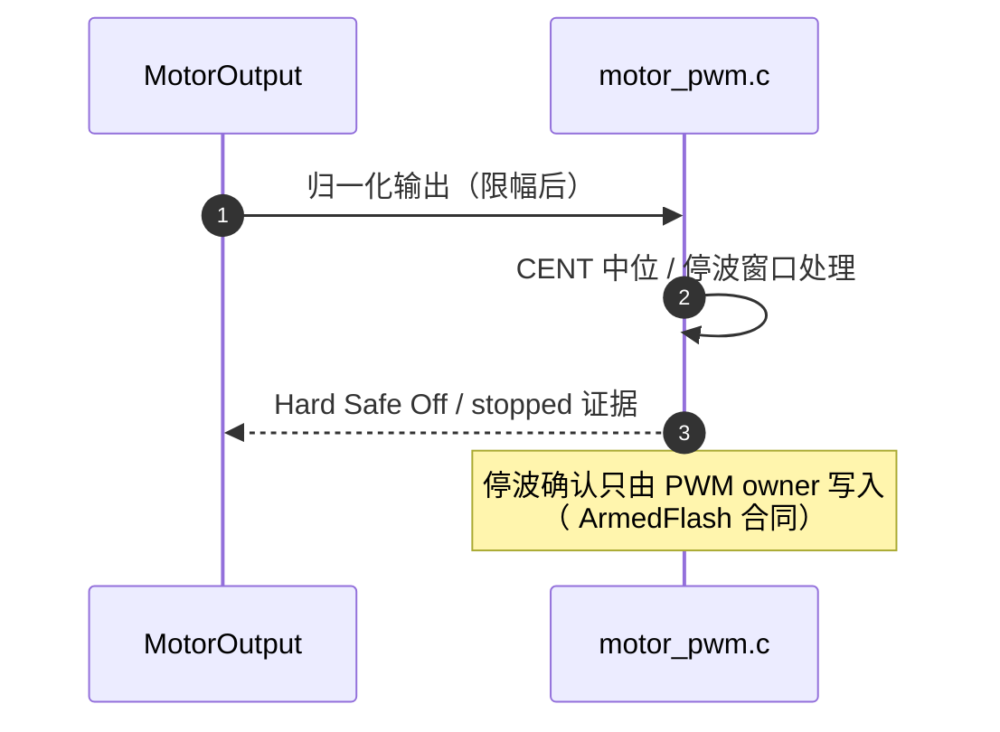

# 板级层（Boards/H743）

## 职责边界

`Boards/H743` 承接：板级初始化、Flash 布局、外设适配与**唯一组合根**。它不依赖上层控制模块；上层经 capability 契约访问它装配的后端。

## 文件清单

| 文件 | 职责 | Source |
|------|------|--------|
| `Src/board_init.c` | 板级早期初始化 | [board_init.c](https://github.com/a1600778959/H743_FreeRTOS/blob/main/Boards/H743/Src/board_init.c) |
| `Src/motor_pwm.c` | PWM 后端（50Hz、CENT/停波、Hard Safe Off 证据） | [motor_pwm.c](https://github.com/a1600778959/H743_FreeRTOS/blob/main/Boards/H743/Src/motor_pwm.c) |
| `Src/fatfs_diskio.cpp` | SD MMC 磁盘 IO + `get_fattime`（北京时间）+ io_stats（used 属性） | [fatfs_diskio.cpp](https://github.com/a1600778959/H743_FreeRTOS/blob/main/Boards/H743/Src/fatfs_diskio.cpp) |
| `Src/boot_diagnostics*.c` | 引导诊断区读写 | [boot_diagnostics.c](https://github.com/a1600778959/H743_FreeRTOS/blob/main/Boards/H743/Src/boot_diagnostics.c) |
| `Inc/board_bus_resources.h` | 总线资源分配（DMA/中断/引脚映射） | [board_bus_resources.h](https://github.com/a1600778959/H743_FreeRTOS/blob/main/Boards/H743/Inc/board_bus_resources.h) |
| `Inc/boot_layout.h` | Flash 布局常量 | [boot_layout.h](https://github.com/a1600778959/H743_FreeRTOS/blob/main/Boards/H743/Inc/boot_layout.h) |

## PWM 后端合同

<!-- Sources: Boards/H743/Src/motor_pwm.c:1, Dima/platform/api/Flash.hpp:59 -->

电调兼容边界（部署指南 §3.1/§6.1）：必须支持双向中位控制；单向油门电调不能靠参数冒充可逆后端；脉宽/频率/中位以实测为准（默认 50Hz、1000/1500/2000us）。

## 总线资源与引脚

`board_bus_resources.h` 集中声明 DMA 通道、中断优先级与外设引脚映射；ELF 验证器强制 DMA 区边界（`0x30040000, 32768 B`）——DMA 缓冲放错段直接构建失败（[layout.py](https://github.com/a1600778959/H743_FreeRTOS/blob/main/tools/elf_support/layout.py)）。

## Flash 布局

| 区域 | 地址 | 内容 |
|------|------|------|
| 0x08000000 | MCUboot | 48,928 B |
| 0x08020000–0x0803FFFF | 引导诊断 | boot_diagnostics |
| 0x08040000 | 签名应用（向量 +0x400） | signed bin |
| 0x081E0000 | 参数 FlashFS | 128 KiB 单扇区 |

<!-- Sources: Boards/H743/Inc/boot_layout.h:1, make/release.mk:17 -->

## Related Pages

| Page | Relationship |
|------|-------------|
| [启动链](./startup-chain.md) | board_init 的调用位置 |
| [CubeMX 生成层](./core-hal.md) | Core/ 与板级层的分工 |
| [Capability 契约与组合根](../07-platform/platform.md) | 装配关系 |
