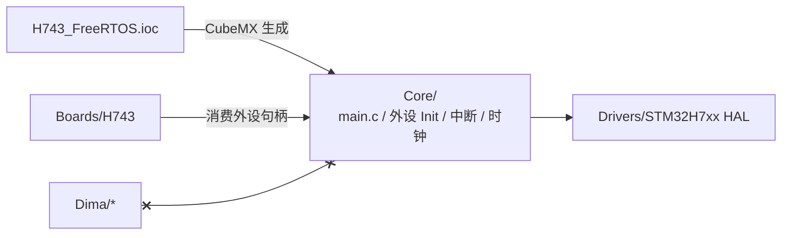

# CubeMX 生成层（Core/）

## 合同

`H743_FreeRTOS.ioc` 是外设配置的**唯一事实源**；`Core/` 全部由 CubeMX 生成——**禁止写任何业务逻辑**（[AGENTS.md](https://github.com/a1600778959/H743_FreeRTOS/blob/main/AGENTS.md#L67)）。

<!-- Sources: AGENTS.md:67, Boards/H743/Src/board_init.c:1 -->

| 层 | 允许 | 禁止 |
|----|------|------|
| Core/ | CubeMX 重新生成覆盖 | 手改（会被覆盖丢失） |
| Boards/H743 | 调用 HAL 句柄、板级适配 | 业务逻辑 |
| Dima/* | 只经 capability 契约 | include HAL/CMSIS/Core 头（门禁拦截） |

## 生成内容

| 生成物 | 用途 |
|--------|------|
| 时钟树初始化 | 480 MHz Cortex-M7 / 总线时钟 |
| GPIO/USART/SDMMC/USB/CAN/FMC 外设初始化 | 板级外设基础 |
| 中断向量与 NVIC 配置 | `stm32h7xx_it.c` |
| FreeRTOS 集成（Middlewares/FreeRTOS） | 内核与堆 |
| ST USB 协议栈（Middlewares/ST） | CDC 设备 |
| FatFs（Middlewares/Third_Party/FatFs） | 文件系统（本项目改过 ffconf：`_USE_CHMOD=1`、`_FS_NORTC=0`） |

<!-- Sources: Middlewares/Third_Party/FatFs/src/ffconf.h, Boards/H743/Src/board_init.c:1 -->

## Middlewares 层

| 中间件 | 本项目角色 |
|--------|-----------|
| FreeRTOS | 内核（`platform/freertos/FreeRTOSConfig.h` 侧配置） |
| MCUboot | 引导与镜像验证（独立 Bootloader 构建） |
| ST USB | CDC 底层（UsbConsole 的硬件面） |
| FatFs | SD 文件系统（日志/原子文件域/任务存储共用 owner） |

## 与门禁的关系

依赖门禁的"硬件操作边界"检查确保：Dima 上层对 HAL 的任何直接使用都会构建失败——所有硬件访问必须落在 Boards/H743 或 platform/stm32h7 的后端实现里（[check_architecture.py:4](https://github.com/a1600778959/H743_FreeRTOS/blob/main/tools/check_architecture.py#L4)）。

## Related Pages

| Page | Relationship |
|------|-------------|
| [板级层](./boards-h743.md) | 消费生成层的适配层 |
| [架构门禁与验证工具](../10-tooling/tooling.md) | include 所有权检查 |
| [分层架构与依赖规则](../02-architecture/layered-architecture.md) | 依赖合同 |
