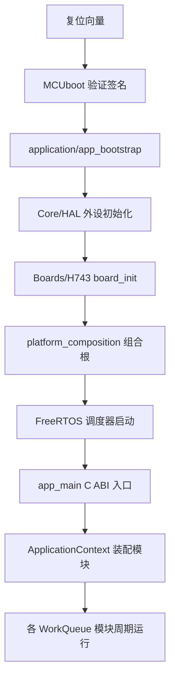
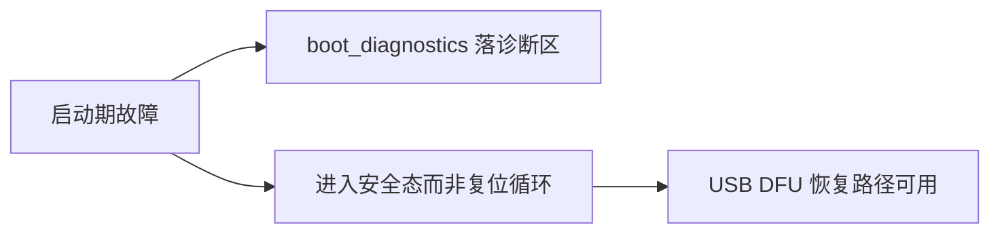

# 启动链

## 路径总览

<!-- Sources: Dima/application/app_main.cpp:1, Dima/application/app_bootstrap.cpp:1, Boards/H743/Src/board_init.c:1, Boards/H743/Src/platform_composition.cpp:1 -->

## 关键文件

| 文件 | 职责 | Source |
|------|------|--------|
| `Dima/application/app_main.cpp` | C ABI 入口 `app_main`，启动 FreeRTOS 世界 | [app_main.cpp](https://github.com/a1600778959/H743_FreeRTOS/blob/main/Dima/application/app_main.cpp) |
| `Dima/application/app_bootstrap.cpp` | 早期引导：C 运行时前置准备 | [app_bootstrap.cpp](https://github.com/a1600778959/H743_FreeRTOS/blob/main/Dima/application/app_bootstrap.cpp) |
| `Boards/H743/Src/board_init.c` | 板级早期初始化（时钟/总线/诊断区） | [board_init.c](https://github.com/a1600778959/H743_FreeRTOS/blob/main/Boards/H743/Src/board_init.c) |
| `Boards/H743/Src/boot_diagnostics.c` + `boot_diagnostics_store.c` | 引导诊断记录（0x08020000 区） | [boot_diagnostics.c](https://github.com/a1600778959/H743_FreeRTOS/blob/main/Boards/H743/Src/boot_diagnostics.c) |
| `Boards/H743/Src/dima_boot_request.c` | 固件侧引导请求（配合 MCUboot） | [dima_boot_request.c](https://github.com/a1600778959/H743_FreeRTOS/blob/main/Boards/H743/Src/dima_boot_request.c) |
| `Dima/rover/ApplicationContext.cpp` | 模块装配、生命周期与一次性迁移 | [ApplicationContext.cpp:285](https://github.com/a1600778959/H743_FreeRTOS/blob/main/Dima/rover/ApplicationContext.cpp#L285) |

## 启动期的一次性迁移

组合根/应用上下文在参数服务初始化后执行 DNA 遗留记录软失效（`invalidate_records('dna0')`）——**只清位不擦除、掉电幂等续跑**，全部失效后为空操作（[ApplicationContext.cpp:285](https://github.com/a1600778959/H743_FreeRTOS/blob/main/Dima/rover/ApplicationContext.cpp#L285)，ADR 0006 决策 4）。

## 启动失败语义

<!-- Sources: Boards/H743/Src/boot_diagnostics_store.c:1, docs/MCUBOOT_USB_RECOVERY_ZH.md:1 -->

模块侧合同呼应：MotorOutput 参数应用冲突走 defer 放弃而非复位（[MotorOutput.cpp:15](https://github.com/a1600778959/H743_FreeRTOS/blob/main/Dima/modules/motor/MotorOutput.cpp#L15)）；BootHealth 启动健康检查决定喂狗起点（[BootHealthService.cpp:78](https://github.com/a1600778959/H743_FreeRTOS/blob/main/Dima/modules/boot_health/BootHealthService.cpp#L78)）。

## Related Pages

| Page | Relationship |
|------|-------------|
| [板级层](./boards-h743.md) | board_init 细节 |
| [MCUboot 与恢复](../09-build-release/mcuboot-recovery.md) | 引导与诊断区 |
| [Capability 契约与组合根](../07-platform/platform.md) | 装配点合同 |
