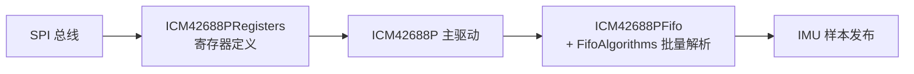
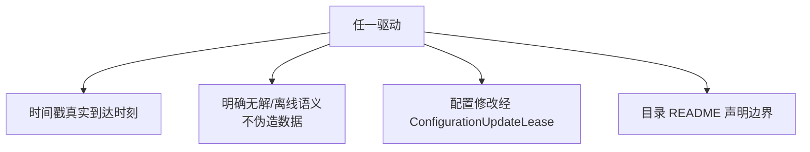

# 驱动全量清单

## 驱动矩阵

| 驱动 | 目录 | 设备 | 总线 | 输出 Topic | Source |
|------|------|------|------|------------|--------|
| UM982 | `drivers/gps/um982` | 双天线 GNSS/RTK | UART 460800 | `sensor_gps` + `rtk_heading_status` | [Um982Gps.cpp](https://github.com/a1600778959/H743_FreeRTOS/blob/main/Dima/drivers/gps/um982/Um982Gps.cpp) |
| ICM42688P | `drivers/imu/icm42688p` | 6 轴 IMU | SPI | IMU 数据（经 sensors 模块） | [ICM42688P.cpp](https://github.com/a1600778959/H743_FreeRTOS/blob/main/Dima/drivers/imu/icm42688p/ICM42688P.cpp) |
| DroneCAN Mag2 | `drivers/magnetometer/dronecan_mag2` | RM3100 磁力计 | CAN 500k | 磁场（经 VehicleMagnetometer） | [DroneCanMag2.cpp](https://github.com/a1600778959/H743_FreeRTOS/blob/main/Dima/drivers/magnetometer/dronecan_mag2/DroneCanMag2.cpp) |
| SBUS | `drivers/rc/sbus` | 遥控接收机 | UART 100000 8E2 RX 反相 | RC 输入（经 rc 模块） | [SbusRc.cpp](https://github.com/a1600778959/H743_FreeRTOS/blob/main/Dima/drivers/rc/sbus/SbusRc.cpp) |

## ICM42688P（唯一未展开过的驱动）

<!-- Sources: Dima/drivers/imu/icm42688p/ICM42688P.cpp:1, Dima/drivers/imu/icm42688p/ICM42688PFifoAlgorithms.cpp:1 -->

结构：寄存器层（`ICM42688PRegisters`）+ 主驱动 + **FIFO 批量算法**（传感器以 FIFO 批量上抛、算法逐样本解析，减少 SPI 事务数——高频 IMU 的标准做法）。

## SBUS 驱动

| 文件 | 职责 | Source |
|------|------|--------|
| `SbusRc.cpp` | 串口帧接收与生命周期 | [SbusRc.cpp](https://github.com/a1600778959/H743_FreeRTOS/blob/main/Dima/drivers/rc/sbus/SbusRc.cpp) |
| `SbusProtocol.cpp` | SBUS 帧解码（25B/16ch/flags） | [SbusProtocol.cpp](https://github.com/a1600778959/H743_FreeRTOS/blob/main/Dima/drivers/rc/sbus/SbusProtocol.cpp) |

电气合同（不可用普通波特率修复）：固定 100000 bit/s、8E2、RX 反相（[部署指南 §5.1](https://github.com/a1600778959/H743_FreeRTOS/blob/main/docs/H743_VEHICLE_COMMISSIONING_ZH.md#L115)）。

## middleware/drivers

`Dima/middleware/drivers` 提供驱动与 modules 之间的桥接层（设备中断/总线分发），驱动本体不感知业务模块（[middleware/drivers](https://github.com/a1600778959/H743_FreeRTOS/blob/main/Dima/middleware/drivers)）。

## 驱动通用合同

<!-- Sources: Dima/drivers/gps/um982/Um982Gps.cpp:532, Dima/platform/api/Flash.hpp:59 -->

示例：UM982 无配对时照常发布航向但 `velocity_aligned=false`、速度 NaN；NO_FIX 在线状态不伪造经纬度——"宁可明确缺失，不冒充有效"。

## Related Pages

| Page | Relationship |
|------|-------------|
| [UM982 链路](../08-drivers/um982.md) | GPS 驱动深页 |
| [DroneCAN 链路](../08-drivers/dronecan.md) | 磁力计驱动深页 |
| [串口与 RC 模块](./serial-rc.md) | 驱动的模块侧消费者 |
