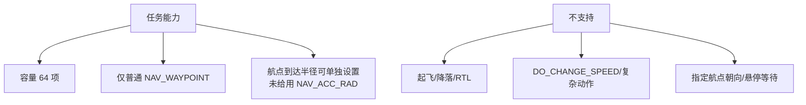
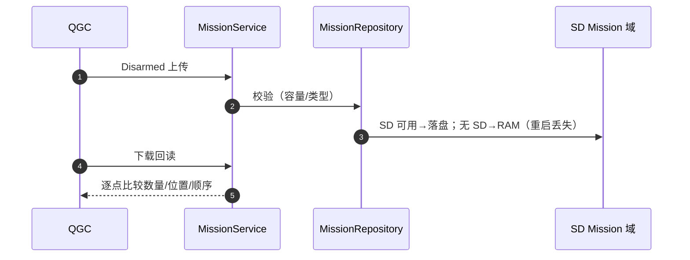

# Mission 任务模块

## 结构

| 文件 | 职责 | Source |
|------|------|--------|
| `MissionService.cpp` | 任务服务：上传/下载/当前项推进 | [MissionService.cpp](https://github.com/a1600778959/H743_FreeRTOS/blob/main/Dima/modules/mission/MissionService.cpp) |
| `MissionCodec.cpp` | MAVLink 任务项编解码 | [MissionCodec.cpp](https://github.com/a1600778959/H743_FreeRTOS/blob/main/Dima/modules/mission/MissionCodec.cpp) |
| `MissionRepository.cpp` | 任务存储（SD 原子文件域 / RAM） | [MissionRepository.cpp](https://github.com/a1600778959/H743_FreeRTOS/blob/main/Dima/modules/mission/MissionRepository.cpp) |
| `MissionSnapshot.cpp` | 当前任务快照（供消费方一致性读取） | [MissionSnapshot.cpp](https://github.com/a1600778959/H743_FreeRTOS/blob/main/Dima/modules/mission/MissionSnapshot.cpp) |

## 能力边界（部署指南 §11 合同）

<!-- Sources: docs/H743_VEHICLE_COMMISSIONING_ZH.md:322, Dima/modules/mission/README.md -->

高度字段协议有效即可（地面车不做越障规划接口）；等待时间/穿越半径默认零；yaw 未指定；autocontinue 开启。

## 存储与回读

<!-- Sources: Dima/modules/mission/MissionRepository.cpp:1, Dima/modules/mission/MissionService.cpp:1 -->

**每次启动重新核对车内任务**——换 SD 卡可能恢复那张卡的旧任务；地图上画好路径不等于车辆已收到。

## 执行与 AutoMode 的关系

任务就绪后由 [AutoMode](../03-rover-domain/auto-mode.md) 消费快照推进航段（段装载 → PurePursuit/SegmentGuidance 跟踪 → 到达切换）；进入 Mission 需要 Armed + 已提交任务 + 估计器就绪。任务结束停在最后航点，**不自动返回出发点**（[AutoMode.cpp:328](https://github.com/a1600778959/H743_FreeRTOS/blob/main/Dima/rover/modes/auto/AutoMode.cpp#L328)，[部署指南 §11.2](https://github.com/a1600778959/H743_FreeRTOS/blob/main/docs/H743_VEHICLE_COMMISSIONING_ZH.md#L332)）。

## MAVLink 侧

任务上传/下载走 MAVLink 任务协议（`MavlinkMission`，[modules/mavlink](https://github.com/a1600778959/H743_FreeRTOS/blob/main/Dima/modules/mavlink)），编解码集中在 MissionCodec——协议与存储解耦。

## Related Pages

| Page | Relationship |
|------|-------------|
| [AutoMode 航段任务](../03-rover-domain/auto-mode.md) | 执行层 |
| [存储域](../06-middleware/storage-domains.md) | Mission 域协议 |
| [MAVLink 链路](../05-modules/mavlink.md) | 传输通道 |
