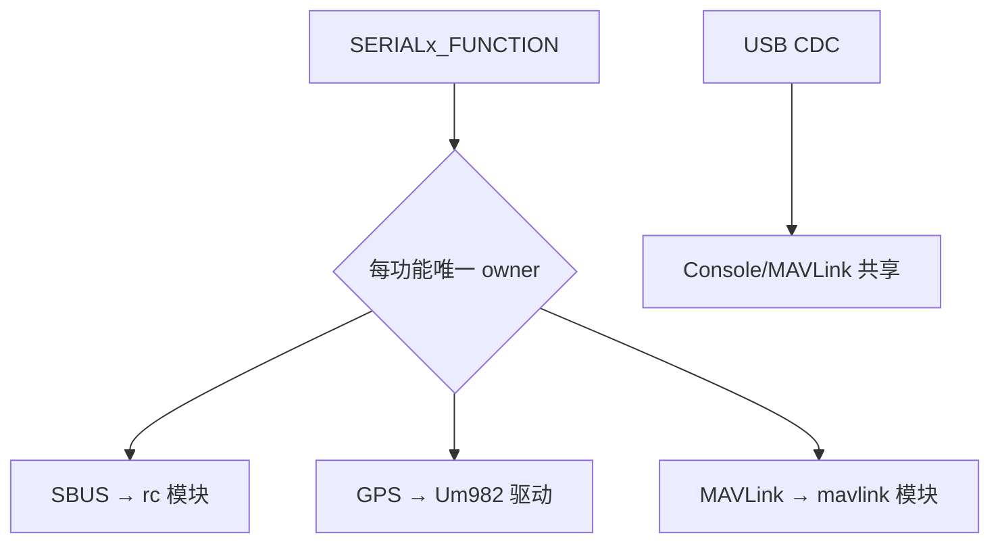
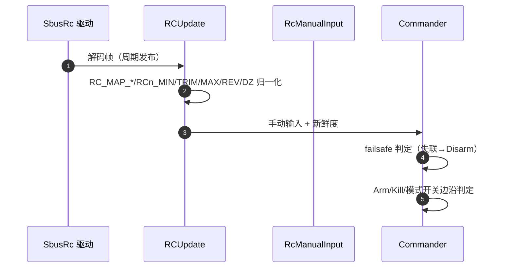

# 串口与 RC 模块

## serial 模块：SERIALx 功能分配

`modules/serial/SerialConfig.cpp` 维护 `SERIALx_FUNCTION/BAUD` 的解析与 owner 管理：

| 合同 | 内容 | Source |
|------|------|--------|
| 编号语义 | SERIALx 编号对应物理 UART/USART 尾号；**不存在 SERIAL5** | [SerialConfig.cpp](https://github.com/a1600778959/H743_FreeRTOS/blob/main/Dima/modules/serial/SerialConfig.cpp) |
| 唯一 owner | SBUS/GPS/MAVLink 各自唯一 owner；功能迁移关闭旧 owner | 同上 |
| 生效 | FUNCTION/BAUD 改动需重启；SBUS 速率不走普通 BAUD（固定 100000 8E2 反相） | 同上 |
| USB | 自身链路，不占 UART 分配 | 同上 |

<!-- Sources: Dima/modules/serial/SerialConfig.cpp:1, Dima/modules/serial/README.md -->

## rc 模块：SBUS 到运动输入

<!-- Sources: Dima/modules/rc/RcManualInput.cpp:1, Dima/modules/rc/RCUpdate.cpp:1, Dima/modules/safety/Commander.cpp:143 -->

| 合同 | 内容 | Source |
|------|------|--------|
| 双向轴 | 油门/转向均中心双向；回中稳定为零（默认死区 30us，旧车零死区不自动变 30） | [rc README](https://github.com/a1600778959/H743_FreeRTOS/blob/main/Dima/modules/rc/README.md) |
| 兼容标记 | `RC_MAP_PITCH/ROLL` 仅 QGC 流程标记，不承担运动控制 | 同上 |
| Failsafe | 接收机 failsafe 不得继续发布"健康旧杆位"；固件侧 RC loss=Disarm | [CommanderSafety.cpp:137](https://github.com/a1600778959/H743_FreeRTOS/blob/main/Dima/modules/safety/CommanderSafety.cpp#L137) |
| 模式槽 | `COM_FLTMODE1..6`；Auto Calibration 槽值 23，仍要求 Disarmed | [CommanderAutoCalibration.cpp:34](https://github.com/a1600778959/H743_FreeRTOS/blob/main/Dima/modules/safety/CommanderAutoCalibration.cpp#L34) |

## 边沿与同帧抑制

解锁开关"启动/恢复后第一次稳定状态只建基线；先 OFF 再明确 ON 才形成解锁请求"；**避免同帧拨模式+Arm+Kill**——同帧安全动作可抑制模式请求，被拒的模式请求不会自动重试（[部署指南 §5.3](https://github.com/a1600778959/H743_FreeRTOS/blob/main/docs/H743_VEHICLE_COMMISSIONING_ZH.md#L135)）。

## 强制解锁的持续确认

RC/执行器判定在 20~50ms 粒度存在单帧瞬态（SBUS 坏帧/EMI），Commander 对强制解锁维持持续确认窗——一帧即杀的历史问题已修（[Commander.cpp:143](https://github.com/a1600778959/H743_FreeRTOS/blob/main/Dima/modules/safety/Commander.cpp#L143)）。

## Related Pages

| Page | Relationship |
|------|-------------|
| [手动模式语义](../03-rover-domain/manual-mode.md) | 输入的下游语义 |
| [驱动全量清单](./drivers-inventory.md) | SBUS 驱动本体 |
| [Commander 安全链](../05-modules/commander.md) | 开关边沿的最终判定 |
