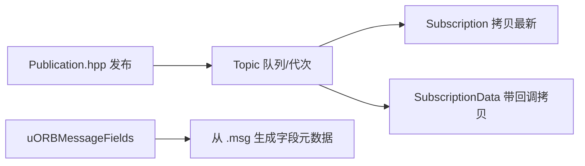
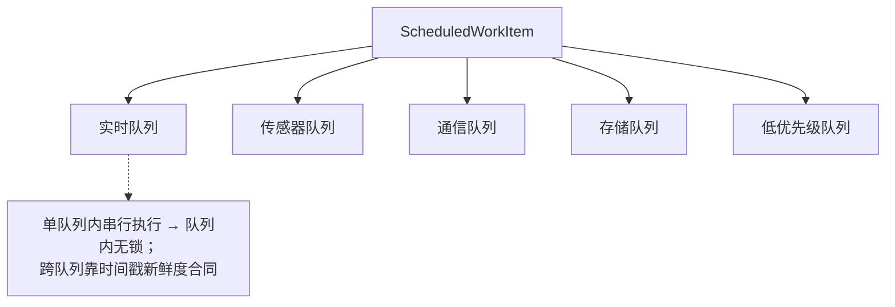

# FreeRTOS 平台内幕

## 后端组成

| 组件 | 文件 | 职责 | Source |
|------|------|------|--------|
| Backend | `Backend.cpp/.hpp` | capability 契约的 FreeRTOS 侧实现装配 | [Backend.cpp](https://github.com/a1600778959/H743_FreeRTOS/blob/main/Dima/platform/freertos/Backend.cpp) |
| BackendTimeout | `BackendTimeout.cpp` | 超时语义统一 | [BackendTimeout.cpp](https://github.com/a1600778959/H743_FreeRTOS/blob/main/Dima/platform/freertos/BackendTimeout.cpp) |
| FreeRTOSConfig.h | 内核配置 | 优先级/堆/tick | [FreeRTOSConfig.h](https://github.com/a1600778959/H743_FreeRTOS/blob/main/Dima/platform/freertos/FreeRTOSConfig.h) |
| HeapOperators | `HeapOperators.cpp` | 堆算子（受限堆策略） | [HeapOperators.cpp](https://github.com/a1600778959/H743_FreeRTOS/blob/main/Dima/platform/freertos/HeapOperators.cpp) |

`platform/freertos` 与 `platform/stm32h7` **互不依赖**——二者只共同实现 `platform/api` 契约（依赖门禁强制）。

## uORB 实现

<!-- Sources: Dima/middleware/uORB/Publication.hpp:1, Dima/middleware/uORB/SubscriptionData.hpp:1, Dima/middleware/uORB/uORBMessageFields.cpp:1 -->

要点：订阅侧 `copy()` 更新最新值并核对代次；`SubscriptionData` 用于需要"取到即处理"的场景；字段元数据由消息 schema 生成，供日志格式缓存推导复用（[generate_logger_contract.py](https://github.com/a1600778959/H743_FreeRTOS/blob/main/tools/logging/generate_logger_contract.py) 的输入）。

## WorkQueue 实现

<!-- Sources: Dima/middleware/work_queue/WorkQueue.cpp:1, Dima/middleware/work_queue/ScheduledWorkItem.hpp:1, Dima/02-architecture 线程与调度 -->

## 支撑服务

| 服务 | 目录 | 用途 | Source |
|------|------|------|--------|
| events | `middleware/events` | 有界事件报告（Severity 分级，StorageFailure 等） | [events.cpp](https://github.com/a1600778959/H743_FreeRTOS/blob/main/Dima/middleware/events/events.cpp) |
| perf | `middleware/perf` | 性能计数器 | [perf_counter.cpp](https://github.com/a1600778959/H743_FreeRTOS/blob/main/Dima/middleware/perf/perf_counter.cpp) |
| lifecycle | `middleware/lifecycle` | module_manager：模块启停与状态 | [module_manager.cpp](https://github.com/a1600778959/H743_FreeRTOS/blob/main/Dima/middleware/lifecycle/module_manager.cpp) |
| maintenance | `middleware/maintenance` | 维护锁语义（与 ArmedFlash 协作） | [maintenance](https://github.com/a1600778959/H743_FreeRTOS/blob/main/Dima/middleware/maintenance) |
| px4_platform_common | `middleware/px4_platform_common` | PX4 平台兼容层（ScheduledWorkItem 基类等） | [px4_platform_common](https://github.com/a1600778959/H743_FreeRTOS/blob/main/Dima/middleware/px4_platform_common) |
| rover | `middleware/rover` | RoverModeContract 等模式契约 | [RoverModeContract.cpp](https://github.com/a1600778959/H743_FreeRTOS/blob/main/Dima/middleware/rover/RoverModeContract.cpp) |

## Related Pages

| Page | Relationship |
|------|-------------|
| [线程与调度](../02-architecture/threading-scheduling.md) | 调度合同的用户视角 |
| [STM32H7 后端](./stm32h7-backends.md) | 姊妹后端 |
| [Capability 契约与组合根](../07-platform/platform.md) | 装配的契约面 |
