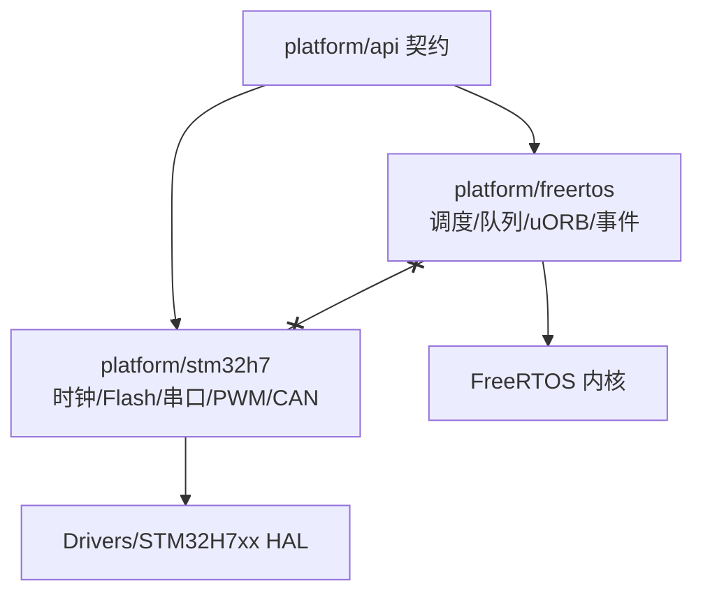
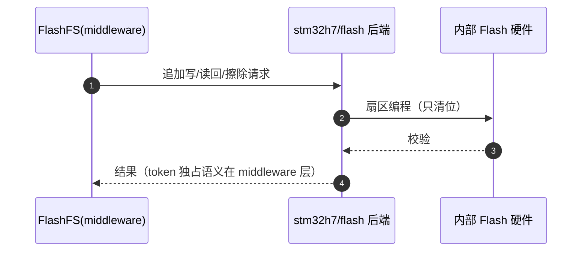

# STM32H7 后端

## 目录构成

| 子目录 | 后端能力 | Source |
|--------|----------|--------|
| `system/` | 时钟/复位/系统服务 | [system](https://github.com/a1600778959/H743_FreeRTOS/blob/main/Dima/platform/stm32h7/system) |
| `memory/` | 内存布局/段管理（DMA 区等） | [memory](https://github.com/a1600778959/H743_FreeRTOS/blob/main/Dima/platform/stm32h7/memory) |
| `flash/` | 内部 Flash 读写/擦除（参数分区载体） | [flash](https://github.com/a1600778959/H743_FreeRTOS/blob/main/Dima/platform/stm32h7/flash) |
| `serial/` | UART 驱动后端（SBUS/GPS/MAVLink 串口） | [serial](https://github.com/a1600778959/H743_FreeRTOS/blob/main/Dima/platform/stm32h7/serial) |
| `pwm/` | PWM 输出后端（与 Boards motor_pwm 协作） | [pwm](https://github.com/a1600778959/H743_FreeRTOS/blob/main/Dima/platform/stm32h7/pwm) |
| `can/` | CAN 后端（DroneCAN 总线） | [can](https://github.com/a1600778959/H743_FreeRTOS/blob/main/Dima/platform/stm32h7/can) |
| `interrupts/` | 中断管理 | [interrupts](https://github.com/a1600778959/H743_FreeRTOS/blob/main/Dima/platform/stm32h7/interrupts) |
| `HardwareServices.hpp` | 硬件服务聚合入口 | [HardwareServices.hpp](https://github.com/a1600778959/H743_FreeRTOS/blob/main/Dima/platform/stm32h7/HardwareServices.hpp) |

## 与 FreeRTOS 后端的边界

<!-- Sources: AGENTS.md:52, Dima/platform/stm32h7/HardwareServices.hpp:1 -->

两后端互不 include（fast 门禁检查项）；唯一把两者接到一起的是 `Boards/H743/Src/platform_composition.cpp` 组合根。

## Flash 后端与参数分区

<!-- Sources: Dima/platform/stm32h7/flash, Dima/middleware/parameters/flashfs.cpp:434 -->

分层：**token/记录/擦除互斥语义在 middleware**，物理编程在后端——换 MCU 只换后端层。

## 内存后端

DMA 区域（`0x30040000, 32768 B`）由 memory 后端与 ELF 验证器共同把关：DMA 可达缓冲必须在专属段，放错即构建失败（[layout.py](https://github.com/a1600778959/H743_FreeRTOS/blob/main/tools/elf_support/layout.py)）。

## 串口后端

serial 后端实现 UART 收发与 DMA/中断；SBUS 的电气特例（100000 8E2 RX 反相）在驱动配置中固定，不经普通 BAUD 参数（[serial](https://github.com/a1600778959/H743_FreeRTOS/blob/main/Dima/platform/stm32h7/serial)，[SerialConfig.cpp](https://github.com/a1600778959/H743_FreeRTOS/blob/main/Dima/modules/serial/SerialConfig.cpp)）。

## Related Pages

| Page | Relationship |
|------|-------------|
| [FreeRTOS 平台内幕](./freertos-internals.md) | 姊妹后端 |
| [板级层](../12-startup-board/boards-h743.md) | 板级适配 |
| [存储域](../06-middleware/storage-domains.md) | Flash 后端的最大用户 |
