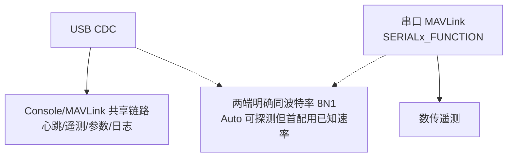
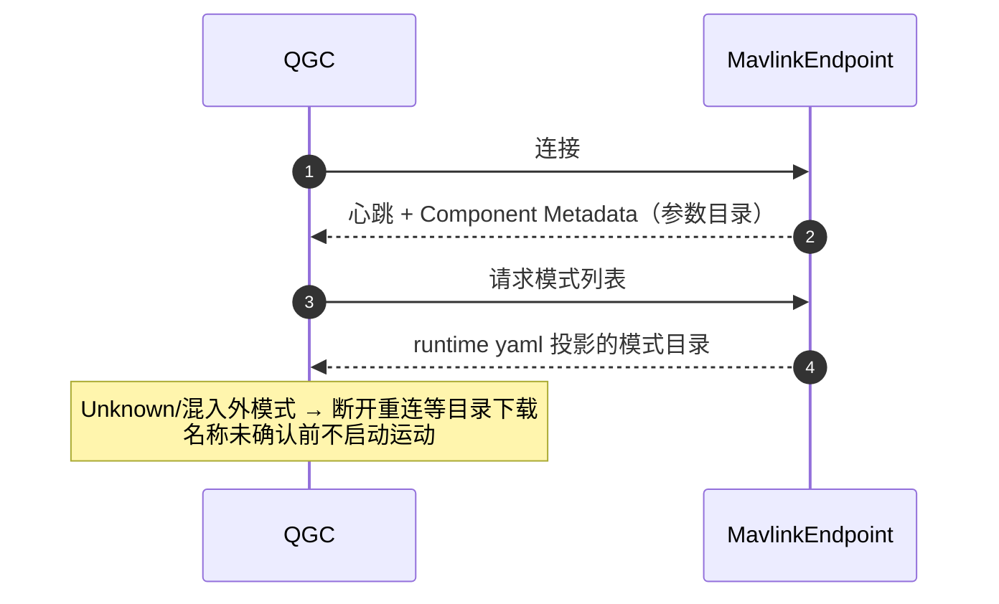

# MAVLink 运行配置

## 权威输入：mavlink_runtime.yaml

模式编号的**唯一权威输入**是 [mavlink_runtime.yaml](https://github.com/a1600778959/H743_FreeRTOS/blob/main/Dima/modules/mavlink/mavlink_runtime.yaml)——PX4 v1.17.0 `px4_custom_mode.h` 的产品投影，收发端共同消费生成常量，编号只在此定义：

| 模式 | main/sub | nav_state | 备注 |
|------|----------|-----------|------|
| Manual | 1/0 | `NAVIGATION_STATE_MANUAL` | 用户可选 |
| Mission | 4/4 | `NAVIGATION_STATE_AUTO_MISSION` | MAV_STANDARD_MODE_MISSION |
| Hold | 4/3 | `NAVIGATION_STATE_AUTO_LOITER` | `MAV_MODE_PROPERTY_NOT_USER_SELECTABLE`（内部态，不进模式菜单） |
| Auto Calibration | 4/11 | `NAVIGATION_STATE_EXTERNAL1` | 值 23 槽位可选；仍要求 Disarmed |

<!-- Sources: Dima/modules/mavlink/mavlink_runtime.yaml:1 -->

## 双链路

<!-- Sources: Dima/modules/mavlink/README.md, docs/H743_VEHICLE_COMMISSIONING_ZH.md#L115 -->

`MAV_0_RATE` 是发送预算，不能把低速链路变高速链路；串口功能迁移会关闭旧 owner，改完统一保存/重启/回读。

## 心跳与模式目录

<!-- Sources: docs/H743_VEHICLE_COMMISSIONING_ZH.md#L104, Dima/modules/mavlink/mavlink_runtime.yaml:1 -->

Hold/Termination 是内部状态——不能照搬通用 PX4 飞行模式菜单操作。

## 遥测流与裁剪

| 项 | 合同 | Source |
|----|------|--------|
| 传感器流 | 13 路订阅 latest 值；无新代次保留最近值 | [MavlinkSensorStreams.cpp:481](https://github.com/a1600778959/H743_FreeRTOS/blob/main/Dima/modules/mavlink/MavlinkSensorStreams.cpp#L481) |
| GPS_RAW_INT 航向 | `rtk_heading_status` 新鲜快照；300ms 窗；NaN=本拍无新观测 | [MavlinkSensorStreams.cpp:481](https://github.com/a1600778959/H743_FreeRTOS/blob/main/Dima/modules/mavlink/MavlinkSensorStreams.cpp#L481) |
| 方言 | 按实际能力裁剪生成，禁止全量 | [AGENTS.md](https://github.com/a1600778959/H743_FreeRTOS/blob/main/AGENTS.md#L63) |
| 任务协议 | MavlinkMission + MissionCodec（64 项 NAV_WAYPOINT） | [MissionCodec.cpp](https://github.com/a1600778959/H743_FreeRTOS/blob/main/Dima/modules/mission/MissionCodec.cpp) |

## 与 USB Console 的耦合

日志下载的 32 帧批次、`kWriteInProgress` 在途语义、4096B 静态组包容量都建立在 Console 契约上——详见 [USB Console](../07-platform/usb-console.md) 与 [MAVLink 链路](../05-modules/mavlink.md)。

## Related Pages

| Page | Relationship |
|------|-------------|
| [MAVLink 链路](../05-modules/mavlink.md) | 端点与协议细节 |
| [串口与 RC 模块](../13-drivers-peripherals/serial-rc.md) | 串口分配 |
| [Mission 任务模块](../13-drivers-peripherals/mission.md) | 任务协议消费方 |
