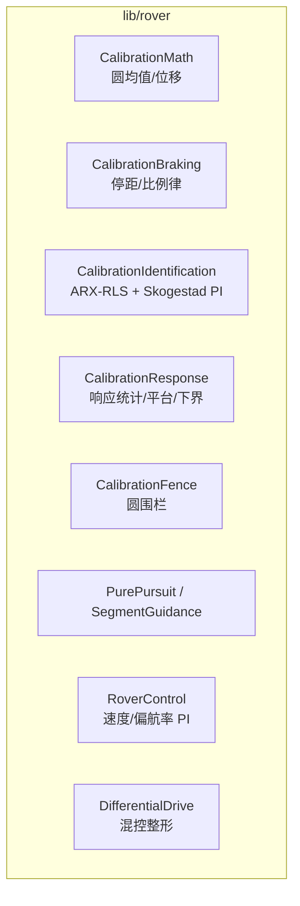

# 支撑库（lib/）

`Dima/lib/` 全部为平台无关库——不依赖 FreeRTOS/HAL（依赖门禁强制），可独立测试。

## 库清单

| 库 | 用途 | 主要消费方 | Source |
|----|------|------------|--------|
| `mathlib` / `matrix` | 数学基础与矩阵运算 | EKF2、校准、控制 | [mathlib](https://github.com/a1600778959/H743_FreeRTOS/blob/main/Dima/lib/mathlib) |
| `geo` / `lat_lon_alt` | 大地坐标：displacement、圆均值地理计算 | 校准围栏、返场 | [geo](https://github.com/a1600778959/H743_FreeRTOS/blob/main/Dima/lib/geo) |
| `world_magnetic_model` | 世界地磁模型 | 磁校准参考 | [world_magnetic_model](https://github.com/a1600778959/H743_FreeRTOS/blob/main/Dima/lib/world_magnetic_model) |
| `timesync` | 时间同步 | 授时链 | [timesync](https://github.com/a1600778959/H743_FreeRTOS/blob/main/Dima/lib/timesync) |
| `hysteresis` | 迟滞状态机（顶部/底部事件） | 各类判定去抖 | [hysteresis](https://github.com/a1600778959/H743_FreeRTOS/blob/main/Dima/lib/hysteresis) |
| `containers` | 容器（环形队列等，无动态分配） | 全仓库 | [containers](https://github.com/a1600778959/H743_FreeRTOS/blob/main/Dima/lib/containers) |
| `format` | 格式化（Format.hpp，校准诊断三短行等） | 诊断、日志 | [format](https://github.com/a1600778959/H743_FreeRTOS/blob/main/Dima/lib/format) |
| `tinybson` | 小型 BSON 序列化 | 参数/存储 | [tinybson](https://github.com/a1600778959/H743_FreeRTOS/blob/main/Dima/lib/tinybson) |
| `serial` | 串口协议公共件 | 驱动层 | [serial](https://github.com/a1600778959/H743_FreeRTOS/blob/main/Dima/lib/serial) |
| `sensors` | 传感器公共算法 | 校准/传感器模块 | [sensors](https://github.com/a1600778959/H743_FreeRTOS/blob/main/Dima/lib/sensors) |
| `ekf2` | EKF2 数学件 | modules/ekf2 | [ekf2](https://github.com/a1600778959/H743_FreeRTOS/blob/main/Dima/lib/ekf2) |
| `dronecan` | DroneCAN 节点/DNA | 磁力计驱动 | [dronecan](https://github.com/a1600778959/H743_FreeRTOS/blob/main/Dima/lib/dronecan) |
| `rover` | 校准/控制领域算法（本 wiki 多页展开） | rover 域 | [rover](https://github.com/a1600778959/H743_FreeRTOS/blob/main/Dima/lib/rover/README.md) |

## rover 子库（领域算法）

<!-- Sources: Dima/lib/rover/README.md:1 -->

`rover/` 目录规则（AGENTS.md）：**只放纯算法**——任何硬件上下文/调度依赖都在 rover 模块层。

## 使用纪律

| 纪律 | 理由 | Source |
|------|------|--------|
| 新增数学优先复用本层 | 单位与判据全仓库一致（如圆均值浓度判据防野点） | [CalibrationMath.hpp](https://github.com/a1600778959/H743_FreeRTOS/blob/main/Dima/lib/rover/CalibrationMath.hpp) |
| 容器禁止动态分配 | RAM 纪律（D2 82.6% 告警区） | [resource budget](../02-architecture/resource-budget.md) |
| 上游导入记 Source Manifest | 版权头保留 + 来源记录 | [DIMA_SOURCE_MANIFEST.md](https://github.com/a1600778959/H743_FreeRTOS/blob/main/docs/DIMA_SOURCE_MANIFEST.md) |

## Related Pages

| Page | Relationship |
|------|-------------|
| [差速控制栈](../03-rover-domain/control-stack.md) | rover 子库详解 |
| [辨识与 PI 公式](../04-auto-calibration/identification-pi.md) | Skogestad 来源 |
| [FreeRTOS 平台内幕](../14-platform-internals/freertos-internals.md) | 上层运行环境 |
