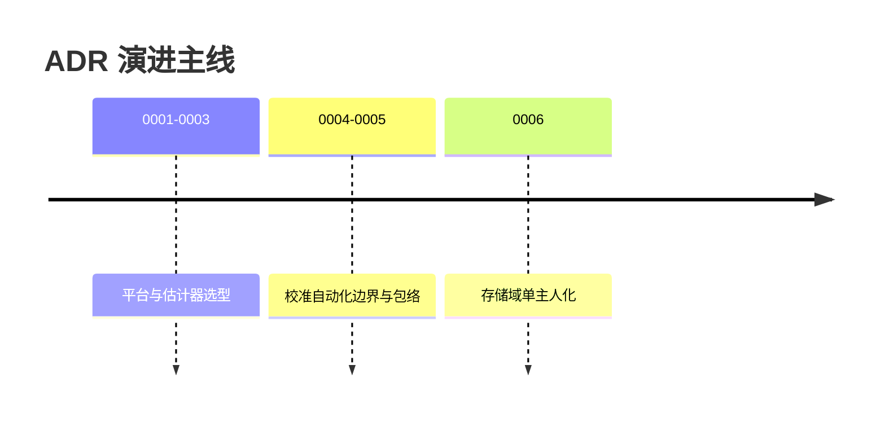

# ADR 索引

架构决策记录（ADR）记录"为什么这样设计"；全文在 [docs/adr/](https://github.com/a1600778959/H743_FreeRTOS/blob/main/docs/adr/README.md)，新增决策用 template.md。

| ADR | 决策 | 一句话理由 | 全文 |
|-----|------|------------|------|
| 0001 | 采用 FreeRTOS 构建 Dima Rover | 调度模型与生态成熟度（vs 裸机/其他 RTOS） | [0001](https://github.com/a1600778959/H743_FreeRTOS/blob/main/docs/adr/0001-use-freertos-for-dima-rover.md) |
| 0002 | 优先复用上游模块 + Dima 目录命名 | PX4 模块直接移植 + 命名空间 `dima`，不重写已有功能 | [0002](https://github.com/a1600778959/H743_FreeRTOS/blob/main/docs/adr/0002-upstream-reuse-and-dima-directory-naming.md) |
| 0003 | 采用 PX4 EKF2 单实例估计器 | 估计器不重造；输入打包在 Ekf2Inputs | [0003](https://github.com/a1600778959/H743_FreeRTOS/blob/main/docs/adr/0003-use-ekf2-estimator.md) |
| 0004 | 当前阶段传感器自动化参数边界 | 哪些自动化参数进入产品、哪些留给校准 | [0004](https://github.com/a1600778959/H743_FreeRTOS/blob/main/docs/adr/0004-stage-sensor-automation.md) |
| 0005 | 自动校准冻结包络 + 磁油门补偿只读参数化 | 包络=冻结 MOT_THR_MAX；磁补偿事务只读化 | [0005](https://github.com/a1600778959/H743_FreeRTOS/blob/main/docs/adr/0005-auto-calibration-manual-parity-envelope.md) |
| 0006 | DNA 分配表迁出参数 FlashFS，改存 SD 原子文件域 | 双 token 互锁整区擦除→满区永久不可回收；单主人化 | [0006](https://github.com/a1600778959/H743_FreeRTOS/blob/main/docs/adr/0006-dna-allocation-storage-sd-domain.md) |

<!-- Sources: docs/adr/README.md:1 -->

## ADR 使用规则

1. 影响"跨模块边界/数据所有权/外部协议"的变更**应先有 ADR**（0006 即 DNA 迁移的全过程记录）。
2. ADR 状态字段标注实施/验收状态（如 0006 "源码实施；板端验收待执行"）。
3. 旧 ADR 不修改结论——新决策新编号，冲突处以新为准。

## Related Pages

| Page | Relationship |
|------|-------------|
| [权威文档导读](./docs-map.md) | 全部文档地图 |
| [存储域](../06-middleware/storage-domains.md) | ADR 0006 的实现 |
| [Capability 契约与组合根](../07-platform/platform.md) | 架构合同的执行面 |
