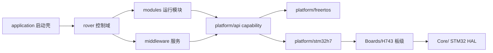

# Dima H743 Rover

STM32H743VIT6（Cortex-M7, 480 MHz）+ FreeRTOS 差速漫游车固件。以 PX4 v1.17.0 为代码基线、ArduPilot Rover 为行为参考；产品名 Dima，C++ 命名空间 `dima`。

## Quick Start

```bash
# 完整验证目标：fast 架构门禁 + 构建 + 签名/镜像校验 + ELF 校验
make verify

# 纯固件构建 / 完整发布产物
make firmware
make dima_rover

# 显式全量架构审计（修改模块边界或构建规则后必须）
make check-architecture
```

所有 make 命令在仓库根目录执行（Windows 下经 `make.cmd`）。工具链（Arm GCC 10.3.1、ccache）由构建系统按需解析到 `~/.cache/dima-rover/host-tools/`，无需手工安装。

## Architecture Overview


<!-- Sources: AGENTS.md:1, Dima/platform/api/Flash.hpp:1, Boards/H743/Src/platform_composition.cpp:1 -->

依赖方向是本仓库的硬性合同：`rover → modules / middleware / messages / lib / platform/api`；`platform/freertos` 与 `platform/stm32h7` 互不依赖；只有 `Boards/H743/Src/platform_composition.cpp` 这一个组合根能把具体后端装配到 capability 契约上。

## Documentation Map

| Section | Description |
|---------|-------------|
| [Onboarding](./onboarding/) | 面向贡献者 / 资深工程师 / 管理层 / 产品经理的四份导读 |
| [快速上手](./01-getting-started/) | 项目总览、构建与验证、快速参考 |
| [架构](./02-architecture/) | 分层架构与依赖规则 |
| [Rover 控制域](./03-rover-domain/) | 差速控制栈与公共算法 |
| [自动校准](./04-auto-calibration/) | 状态机、调度合同、事务机 |
| [运行模块](./05-modules/) | Motor / Commander / MAVLink / 日志 / 传感器 |
| [中间件](./06-middleware/) | 参数、uORB、存储域 |
| [平台层](./07-platform/) | Capability 契约与组合根 |
| [驱动](./08-drivers/) | UM982 GNSS 与 DroneCAN 链路 |
| [构建与发布](./09-build-release/) | 构建、签名、MCUboot OTA |
| [工具链](./10-tooling/) | 架构门禁与验证工具 |
| [首次运行与参数标准](./11-first-run/) | 参数设置建议、分阶段验收标准、现场清单 |
| [启动与板级](./12-startup-board/) | 启动链、Boards/H743、CubeMX 生成层 |
| [驱动与外设](./13-drivers-peripherals/) | 驱动全量、串口/RC、Mission |
| [平台内幕](./14-platform-internals/) | FreeRTOS 与 STM32H7 后端实现 |
| [MAVLink 运行配置](./15-mavlink-runtime/) | 模式投影权威输入与双链路 |
| [支撑库](./16-support-libs/) | lib/ 下 14 个平台无关库 |
| [文档地图](./17-docs-map/) | 27 篇权威文档导读与 ADR 索引 |

## Key Files

| File | Purpose | Source |
|------|---------|--------|
| `AGENTS.md` | 仓库合同：目录边界、依赖方向、构建命令 | [AGENTS.md:1](https://github.com/a1600778959/H743_FreeRTOS/blob/main/AGENTS.md#L1) |
| `GNUmakefile` | 外层调度 Make：进度计划化、ccache 门控 | [GNUmakefile:48](https://github.com/a1600778959/H743_FreeRTOS/blob/main/GNUmakefile#L48) |
| `make/project.mk` | 应用源、生成链与编译规则（含 LTO） | [make/project.mk:1141](https://github.com/a1600778959/H743_FreeRTOS/blob/main/make/project.mk#L1141) |
| `make/release.mk` | 签名、MCUboot、镜像验证与上传规则 | [make/release.mk:57](https://github.com/a1600778959/H743_FreeRTOS/blob/main/make/release.mk#L57) |
| `Dima/rover/ApplicationContext.cpp` | 应用上下文：模块装配与生命周期 | [Dima/rover/ApplicationContext.cpp:285](https://github.com/a1600778959/H743_FreeRTOS/blob/main/Dima/rover/ApplicationContext.cpp#L285) |
| `Boards/H743/Src/platform_composition.cpp` | 后端与 capability 的唯一组合根 | [Boards/H743/Src/platform_composition.cpp:1](https://github.com/a1600778959/H743_FreeRTOS/blob/main/Boards/H743/Src/platform_composition.cpp#L1) |
| `docs/ARCHITECTURE_ZH.md` | 软件架构与依赖规则权威文档 | [docs/ARCHITECTURE_ZH.md:1](https://github.com/a1600778959/H743_FreeRTOS/blob/main/docs/ARCHITECTURE_ZH.md#L1) |

## Tech Stack

| Technology | Purpose |
|-----------|---------|
| STM32H743VIT6 / Cortex-M7 480 MHz | 目标 MCU |
| FreeRTOS + px4 WorkQueue 模式 | RTOS 与调度 |
| C++17（`dima` 命名空间）+ C（HAL 生成层） | 实现语言 |
| uORB 消息总线（PX4 移植） | 模块间通信 |
| MAVLink v2（裁剪方言生成） | 地面站链路 |
| MCUboot + 签名镜像 | 安全启动与 OTA |
| DroneCAN（动态节点分配） | 外设总线（磁力计等） |
| UM982 双天线 RTK | GNSS 定位定向 |
| VitePress + Mermaid | 本 wiki 站点 |
