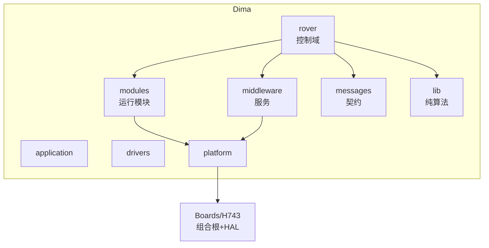

# 贡献者指南

面向第一次接触本仓库的嵌入式开发者。假设你熟悉 C/C++ 与实时系统概念，但不了解本仓库。全文引用均指向 GitHub `main` 分支源文件。

## Part I · 技术栈基础

### 与通用 C++ 项目的差异

| 维度 | 桌面/服务端 C++ | 本仓库 |
|------|----------------|--------|
| 内存 | 堆分配自由 | 静态分配为主，`bss=627 KB` 上限受 SRAM 预算约束 |
| 并发 | 线程 + 锁 | FreeRTOS Task + PX4 式 WorkQueue（模块在自己的队列排队执行） |
| 模块通信 | 直接函数调用 | uORB 发布/订阅（异步、有代次语义） |
| 构建产物 | 可执行文件 | 签名二进制镜像 + MCUboot 引导 |

### 必须先建立的四个概念

1. **uORB**：PX4 的发布/订阅总线。Topic 以 `.msg` 契约定义在 `Dima/messages/schemas/`，如 [AutoCalibrationStatus.msg](https://github.com/a1600778959/H743_FreeRTOS/blob/main/Dima/messages/schemas/AutoCalibrationStatus.msg)。发布方与订阅方解耦，读侧用 `uORB::Subscription` 拷贝最新值。
2. **WorkItem**：模块继承 `px4::ScheduledWorkItem`，按周期或事件被调度。每个模块的 README 声明它运行在哪个队列、周期多少。
3. **Capability 契约**：硬件能力抽象为 `Dima/platform/api/` 下的纯虚接口（如 [Flash.hpp](https://github.com/a1600778959/H743_FreeRTOS/blob/main/Dima/platform/api/Flash.hpp)），上层只依赖接口，不依赖 HAL。
4. **架构门禁**：每次 `make verify` 会跑依赖方向检查（fast 档），违规直接构建失败——见 [工具链](../10-tooling/tooling.md)。

## Part II · 本仓库的架构与领域模型

### 目录即边界

<!-- Sources: AGENTS.md:1, docs/ARCHITECTURE_ZH.md:1 -->

### 领域模型：车在跑什么

- **运动链**：`AutoMode`（航段任务）或手动输入 → `RoverDifferential`（差速控制、PI 速度环/偏航率环）→ `MotorOutput`（PWM 后端、安全限幅）→ 电机。
- **校准链**：`Commander` 受理请求 → `AutoCalibrationMode` 状态机（直线/转圈/磁测/辨识/验证）→ 候选参数经 `CalibrationParameters` 事务（临时写入→确认→提交/回滚）。
- **安全链**：`Commander` 维护 Armed 状态与 failsafe；`MotorOutputSafety` 做输出级失鲜/限幅；`BootHealthService` 决定 IWDG 喂狗。

三条链全部通过 uORB 解耦，任何一环的失败不得级联阻塞喂狗与通信链路（见 [MotorOutput 参数应用租约](https://github.com/a1600778959/H743_FreeRTOS/blob/main/Dima/modules/motor/MotorOutput.cpp#L15) 的注释合同）。

## Part III · 上手与合入

### 环境

- Windows + Git Bash（本仓库的现实工作环境）；工具链由 make 自动解析，无需手工安装。
- `make verify` 是唯一验收门：改任何代码后必须跑通。

### 第一次改代码的建议路径

1. 选一个 `Dima/modules/` 下的独立模块（推荐 `boot_health` 或 `logging`），读完它的 `README.md`。
2. 改动 → `make verify` → 观察 `[N/M] 文件名` 进度输出与 `ARCH check-architecture(fast)` 结果。
3. 如果动了目录结构/构建规则，显式跑 `make check-architecture`（full 档）。

### 仓库规则速记

| 规则 | 出处 |
|------|------|
| 禁止上层反向依赖 rover | [AGENTS.md 依赖方向](https://github.com/a1600778959/H743_FreeRTOS/blob/main/AGENTS.md#L52) |
| 同目录头文件直接写文件名，跨目录从职责层根写起 | [AGENTS.md 头文件引用](https://github.com/a1600778959/H743_FreeRTOS/blob/main/AGENTS.md#L64) |
| CubeMX 生成区 `Core/` 不写业务逻辑 | [AGENTS.md CubeMX](https://github.com/a1600778959/H743_FreeRTOS/blob/main/AGENTS.md#L67) |
| 参数尽量少、自动调整尽量多 | `docs/` 产品原则 |
| MAVLink 按实际能力裁剪，禁止全量引入 | [AGENTS.md MAVLink](https://github.com/a1600778959/H743_FreeRTOS/blob/main/AGENTS.md#L63) |

## 术语表（节选）

| 术语 | 含义 |
|------|------|
| uORB | PX4 发布/订阅总线，Topic 有代次（generation）语义 |
| WorkQueue | FreeRTOS 优先级队列上的延迟执行上下文 |
| Capability | `platform/api` 中的硬件能力虚接口 |
| 组合根 | `platform_composition.cpp`，唯一把具体后端接上 capability 的位置 |
| 停波（stop-wave） | 校准维护窗口内 PWM 后端确认物理停止脉冲输出的状态 |
| 候选/事务 | 校准参数的临时写入→确认→提交/回滚流程 |
| fast/full 门禁 | `make verify` 内嵌的关键检查 vs 显式 `check-architecture` 全量审计 |

## References

- [AGENTS.md](https://github.com/a1600778959/H743_FreeRTOS/blob/main/AGENTS.md) — 仓库合同
- [docs/ARCHITECTURE_ZH.md](https://github.com/a1600778959/H743_FreeRTOS/blob/main/docs/ARCHITECTURE_ZH.md) — 架构权威文档
- [docs/AUTO_CALIBRATION_PLAN_ZH.md](https://github.com/a1600778959/H743_FreeRTOS/blob/main/docs/AUTO_CALIBRATION_PLAN_ZH.md) — 自动校准方案

## Related Pages

| Page | Relationship |
|------|-------------|
| [构建与验证](../01-getting-started/build-and-verify.md) | make 目标详解 |
| [分层架构与依赖规则](../02-architecture/layered-architecture.md) | Part II 的展开 |
| [资深工程师指南](./staff-engineer-guide.md) | 架构深读路径 |
