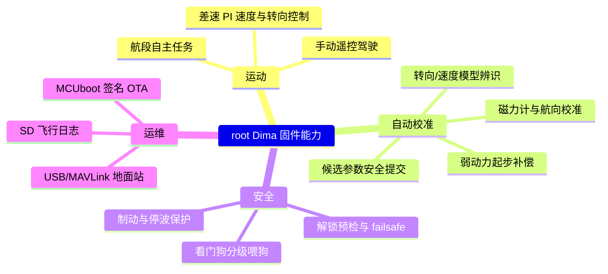

# 管理层指南

面向工程负责人。无代码、无工程术语堆砌，只回答三个问题：这台车固件**能做什么**、**风险在哪**、**该往哪投入**。

## 项目能力地图

<!-- Sources: AGENTS.md:1, docs/H743_VEHICLE_COMMISSIONING_ZH.md:1 -->

## 现状评估

| 维度 | 状态 | 说明 |
|------|------|------|
| 架构债 | **低且受控** | 依赖方向有机器门禁强制，违规无法合入 |
| 代码规模 | 固件 Flash 占用 75% | 每次构建输出实时水位，接近前有预警 |
| 测试 | 编译期验证完善 | 架构审计 + 镜像校验 + ELF 符号合同；**实车路测覆盖是短板** |
| 团队效率 | 高 | 增量构建快（ccache + 计划化进度），验证闭环 ~3.5 分钟 |
| 单点依赖 | 单人深度上下文 | 文档密度高（337 篇 markdown）正在对冲 |

## 风险清单（按优先级）

1. **实车验证缺口**：自动校准的终态路径、OTA 恢复、极端工况尚未完成系统性实车验收。缓解：上车部署指南（`docs/H743_VEHICLE_COMMISSIONING_ZH.md`）已给出分阶段验收流程。
2. **RAM 水位**：D2 SRAM 占用 82.6%，接近告警线。缓解：构建时水位可视 + TCM 预算独立受控。
3. **自动校准复杂度**：状态机是全仓库最复杂模块，历史上多次实车问题集中于此。缓解：已完成整体重构（47→11 状态）并建立调度合同文档。
4. **供应链**：工具链/依赖全部锁定版本并校验，风险低。

## 投资建议

| 方向 | 建议优先级 | 理由 |
|------|-----------|------|
| 实车系统性验收（按上车指南分阶段） | **最高** | 当前所有"已实现"都缺最终证据 |
| 自动校准实车标定迭代 | 高 | 产品核心卖点，代码已就绪 |
| 第二车型/板级抽象复用 | 中 | capability 合同已为多板预留 |
| 仿真/HIL 前置 | 中 | 减少实车迭代成本 |

## Related Pages

| Page | Relationship |
|------|-------------|
| [项目总览](../01-getting-started/overview.md) | 技术视角总览 |
| [产品经理指南](./product-manager-guide.md) | 面向产品视角的能力细节 |
