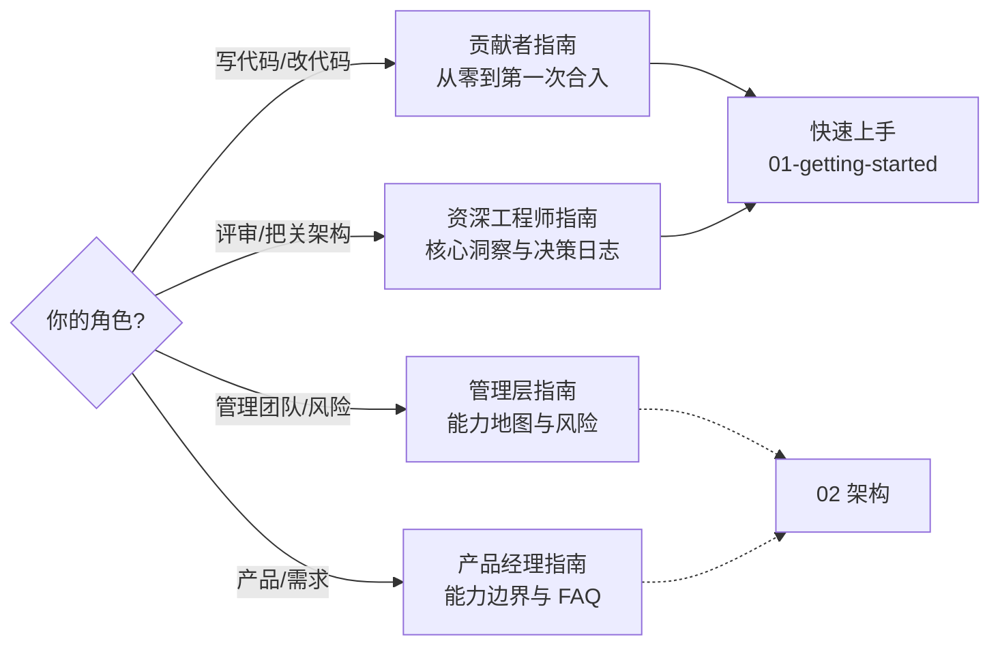

# Onboarding 使用指南

本节提供四份按角色裁剪的导读。内容均基于当前源码（HEAD `ac25482`），引用指向 GitHub `main` 分支源文件。

<!-- Sources: AGENTS.md:1, docs/ARCHITECTURE_ZH.md:1 -->

| 指南 | 适合谁 | 篇幅 |
|------|--------|------|
| [贡献者指南](./contributor-guide.md) | 第一次接触本仓库的嵌入式开发者 | 详细 |
| [资深工程师指南](./staff-engineer-guide.md) | 评审架构、把关技术方向的 IC | 密集 |
| [管理层指南](./executive-guide.md) | 工程 VP / 总监 | 概览 |
| [产品经理指南](./product-manager-guide.md) | 产品、测试与非工程干系人 | 概览 |

## Related Pages

| Page | Relationship |
|------|-------------|
| [项目总览](../01-getting-started/overview.md) | 所有导读的共同起点 |
| [分层架构与依赖规则](../02-architecture/layered-architecture.md) | 全部导读都会引用的硬合同 |
