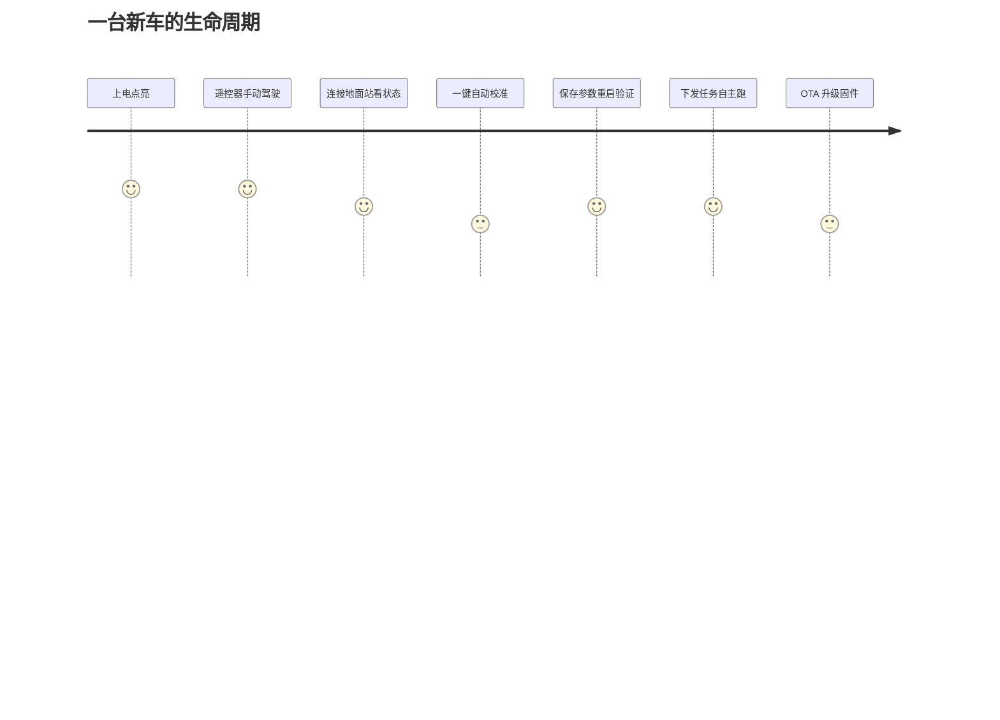

# 产品经理指南

零工程术语版本。读完你能回答：这台车是什么、能可靠做什么、哪些事不能承诺。

## 这是什么产品

一台 **STM32H743 差速轮小车固件**（产品名 Dima）：既能人拿遥控器开，也能按任务自己跑直线/转弯；有一套"自动校准"流程让车自己测出自己的动力特性并调好参数；有完整的日志、地面站连接和固件升级能力。

## 用户旅程

<!-- Sources: docs/H743_VEHICLE_COMMISSIONING_ZH.md:1 -->

## 能力边界（能承诺什么）

| 能承诺 | 不能承诺（当前版本） |
|--------|----------------------|
| 遥控器手动驾驶稳定 | 自动返航（遥控丢失默认解锁停车） |
| 直线/航段自主行驶 | 复杂避障（无避障传感器接入） |
| 自动校准动力参数 | 校准一次必定成功（弱动力车可能分多次） |
| SD 卡完整飞行日志 | 掉电不丢当前段日志 |
| 签名固件 OTA 升级 | 升级失败自动回滚到旧版本 |

## 已知限制

1. **默认参数不是调好的**：新车必须先走"上车部署流程"，手动确认电机方向、中位、传感器安装，再跑自动校准。
2. **自动校准会真实开车**：校准过程车辆会实际运动（包括到全速和主动刹车），必须在空旷场地进行。
3. **低电量无自动动作**：不会自动返航/降落，需要人工接管。
4. **地面站断链不等于失控保护**：遥控器（RC）才是安全主链路。

## 常见问题（FAQ）

**Q: 校准做到一半失败了会怎样？**
会自动恢复原参数、停车、报告失败原因，车保持可用。校准的设计原则是"失败不留痕"。

**Q: 升级固件有风险吗？**
固件是签名的，引导器只运行签名固件。升级失败的恢复流程见 USB DFU 恢复文档。

**Q: 怎么判断车"好了"？**
走完上车指南的分阶段验收：手动驾驶通过 → 校准成功并重启后参数保持 → 简单任务跑完。

## Related Pages

| Page | Relationship |
|------|-------------|
| [管理层指南](./executive-guide.md) | 同一边界的风险视角 |
| [项目总览](../01-getting-started/overview.md) | 技术实现对应关系 |
