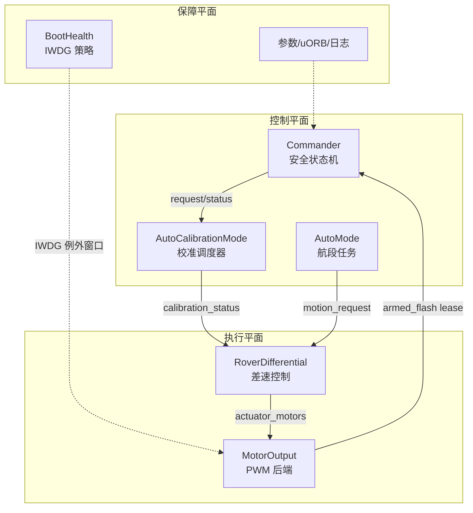
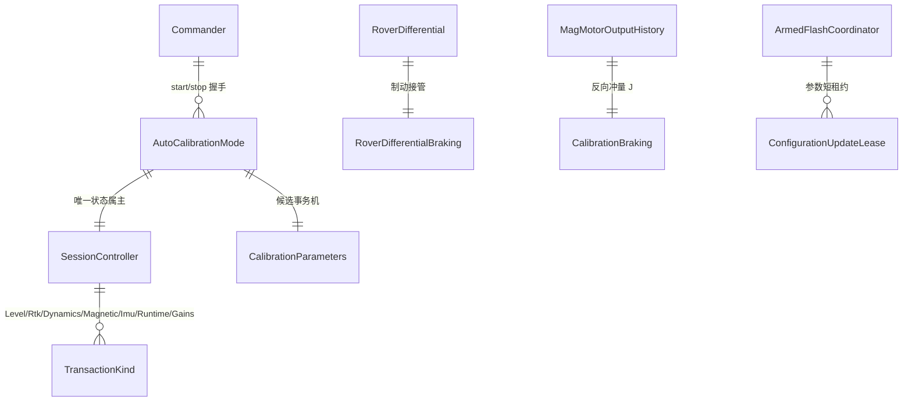

# 资深工程师指南

密集、有观点、为评审与把关服务。全部结论基于源码阅读，推断处显式标注。

## THE 核心洞察

**这是一个把 PX4 的"消息总线 + WorkQueue 调度"骨架，套上"capability 依赖倒置"合同，再以"事务化参数提交"为安全核心的固件。**

用伪代码（Python 风格）表达整个仓库的运行时模型：

```python
# 每个模块 ≈ 一个自调度循环
class Module:
    def Run(self):                    # 运行在各自的 WorkQueue 上
        msgs = self.subs.copy()       # uORB: 拷贝最新代次
        state = self.evaluate(msgs)   # 纯状态机推进
        self.publish(state)           # 发布结果

# 唯一的跨模块写路径是"事务"
class CalibrationTransaction:
    def apply(self, candidates):      # 临时写入（Provisional）
        ...
    def commit(self): ...             # 前端确认后原子生效
    def rollback(self): ...           # 任何失败统一回滚
```

为什么这样设计：无人车固件最常见的死亡螺旋是"一个模块的故障阻塞喂狗 → IWDG 复位 → 全系统重启"。本仓库把"安全收敛"做成不变量：**任何故障路径最终到达的是停波 + 参数回滚 + 一次落盘，而不是复位**。所有机制——ArmedFlash 协调器、参数租约、校准停波窗口、BootHealth 例外窗口——都是这一个不变量的实现细节。

## 系统架构图


<!-- Sources: Dima/modules/safety/CommanderAutoCalibration.cpp:34, Dima/rover/control/RoverDifferential.hpp:115, Dima/modules/motor/MotorOutput.cpp:15, Dima/modules/boot_health/BootHealthService.cpp:305 -->

## 领域模型（核心实体）


<!-- Sources: Dima/rover/modes/auto_calibration/AutoCalibrationMode.hpp:1, Dima/lib/rover/CalibrationBraking.hpp:5, Dima/platform/api/Flash.hpp:59 -->

## 设计权衡与决策日志（节选）

| 决策 | 备选 | 取舍理由 | 证据 |
|------|------|----------|------|
| capability 契约 + 单一组合根 | 直接依赖 HAL | 换后端/仿真不改上层；组合根唯一保证装配一致性 | [platform_composition.cpp:1](https://github.com/a1600778959/H743_FreeRTOS/blob/main/Boards/H743/Src/platform_composition.cpp#L1) |
| DNA 分配表迁 SD 原子文件域 | 与参数共用 FlashFS 分区 | 两 token 互相锁死整区擦除（ADR 0006），满区即永久不可回收 | [ApplicationContext.cpp:285](https://github.com/a1600778959/H743_FreeRTOS/blob/main/Dima/rover/ApplicationContext.cpp#L285) |
| 校准参数走 Provisional 事务 | 直接写参数 | 校准失败必须无痕回滚；`saved=0` 是统一保存设计 | [flashfs.cpp:434](https://github.com/a1600778959/H743_FreeRTOS/blob/main/Dima/middleware/parameters/flashfs.cpp#L434) |
| 制动用两轮自校准比例律 | 固定指数尾模型 | τ₂≡T₁ 的指数尾在 15s 预算内不可辨识；比例律 g=J/(E·T·Δv) 每轮自校准 | [CalibrationBraking.hpp:5](https://github.com/a1600778959/H743_FreeRTOS/blob/main/Dima/lib/rover/CalibrationBraking.hpp#L5) |
| 自动 Level 校准允许 Armed 停波窗口 | 一律要求 Disarmed | 弱动力车解锁即停波会造成 IWDG 复位循环；改为锁存+后端确认 | [Flash.hpp:59](https://github.com/a1600778959/H743_FreeRTOS/blob/main/Dima/platform/api/Flash.hpp#L59) |
| 强制解锁加 20~50ms 持续确认 | 单帧即触发 | SBUS 坏帧/EMI 单帧瞬态会误杀会话 | [Commander.cpp](https://github.com/a1600778959/H743_FreeRTOS/blob/main/Dima/modules/safety/Commander.cpp) |
| LTO 跨编译单元瘦身 | 逐 TU 编译 | 省 33.8 KiB Flash；符号合同由 ELF 验证器兜底 | [project.mk:1141](https://github.com/a1600778959/H743_FreeRTOS/blob/main/make/project.mk#L1141) |

## "去哪深读"顺序

1. [分层架构与依赖规则](../02-architecture/layered-architecture.md) — 合同层
2. [自动校准状态机](../04-auto-calibration/state-machine.md) — 复杂度中心（SessionController、事务机、组调度）
3. [Capability 契约与组合根](../07-platform/platform.md) — ArmedFlash 协调器是安全链枢轴
4. [差速控制栈](../03-rover-domain/control-stack.md) — 制动接管与限速迟滞
5. [中间件服务](../06-middleware/middleware.md) — 存储域与参数事务

## 风险与开放问题

- 实车验收尚未覆盖全部分支（校准终态、OTA 恢复路径）。
- 自动校准模块仍是全仓库复杂度最高点，`docs/AUTO_CALIBRATION_STATE_MACHINE_ZH.md` 与源码需同步演进。
- D2 SRAM 占用 82.6%，新增静态分配需谨慎（构建汇总有实时水位）。

## Related Pages

| Page | Relationship |
|------|-------------|
| [分层架构与依赖规则](../02-architecture/layered-architecture.md) | 本页洞察的合同化表述 |
| [自动校准状态机](../04-auto-calibration/state-machine.md) | 核心复杂度所在 |
| [管理层指南](./executive-guide.md) | 同一架构的非技术视图 |
